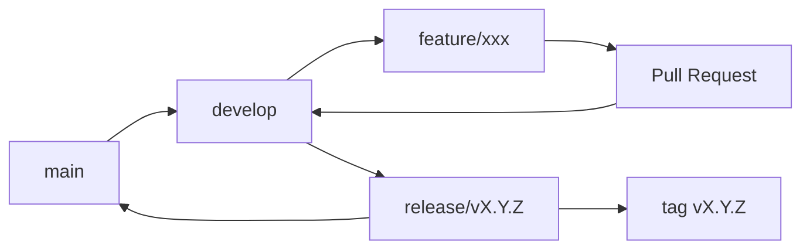
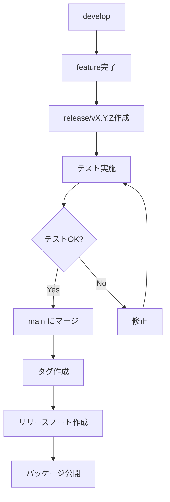

# Contributing Guide - 貢献ガイドライン

*バージョン: v2.0.0*
*最終更新: 2025年01月25日 00:30 JST*

## 🎉 はじめに

Spec Agent System への貢献に興味を持っていただき、ありがとうございます！このプロジェクトは、コミュニティの皆様の貢献によって成長しています。

## 📚 目次

1. [行動規範](#行動規範)
2. [貢献の方法](#貢献の方法)
3. [開発環境のセットアップ](#開発環境のセットアップ)
4. [開発ワークフロー](#開発ワークフロー)
5. [コーディング規約](#コーディング規約)
6. [テストガイドライン](#テストガイドライン)
7. [ドキュメント作成](#ドキュメント作成)
8. [プルリクエスト](#プルリクエスト)
9. [リリースプロセス](#リリースプロセス)

---

## 📜 行動規範

### 基本原則

1. **敬意** - すべての参加者に敬意を持って接する
2. **建設的** - 批判ではなく建設的なフィードバックを提供
3. **包括的** - 多様性を歓迎し、すべての人を受け入れる
4. **協力的** - チームワークと協力を重視

### 禁止事項

- ハラスメント、差別的な言動
- 個人攻撃や侮辱的なコメント
- プライバシーの侵害
- その他、プロフェッショナルでない行為

---

## 🤝 貢献の方法

### 1. Issue の報告

#### バグ報告

```markdown
## バグの概要
[バグの簡潔な説明]

## 再現手順
1. [手順1]
2. [手順2]
3. [手順3]

## 期待される動作
[正しい動作の説明]

## 実際の動作
[現在の動作の説明]

## 環境情報
- OS: [例: Windows 11]
- Node.js: [例: v18.17.0]
- Claude Code: [例: v1.2.3]
- Spec Agent: [例: v2.0.0]

## スクリーンショット
[該当する場合]

## 追加情報
[その他の関連情報]
```

#### 機能リクエスト

```markdown
## 機能の概要
[提案する機能の説明]

## 解決したい問題
[この機能が解決する問題]

## 提案する解決策
[具体的な実装案]

## 代替案
[検討した他の方法]

## 追加コンテキスト
[参考情報やリンク]
```

### 2. コードの貢献

```bash
# 1. リポジトリをフォーク
# GitHubでForkボタンをクリック

# 2. ローカルにクローン
git clone https://github.com/your-username/spec-agent.git
cd spec-agent

# 3. 開発ブランチを作成
git checkout -b feature/amazing-feature

# 4. 変更を実装
# コードを編集

# 5. テストを実行
npm test

# 6. コミット
git add .
git commit -m "feat: Add amazing feature"

# 7. プッシュ
git push origin feature/amazing-feature

# 8. プルリクエストを作成
# GitHubでPull Requestを開く
```

### 3. ドキュメントの改善

- 誤字脱字の修正
- 説明の明確化
- 新しい例の追加
- 翻訳の提供

---

## 🛠️ 開発環境のセットアップ

### 必要なツール

| ツール | バージョン | 用途 |
|--------|----------|------|
| Node.js | 18.0+ | ランタイム |
| npm/yarn | 最新 | パッケージ管理 |
| Git | 2.0+ | バージョン管理 |
| VS Code | 最新 | 推奨エディタ |
| Python | 3.7+ | スクリプト実行 |

### セットアップ手順

```bash
# 1. リポジトリのクローン
git clone https://github.com/KEIEI-NET/spec-agent.git
cd spec-agent

# 2. 依存関係のインストール
npm install
# または
yarn install

# 3. 開発環境の設定
cp .env.example .env
# .envファイルを編集

# 4. 開発サーバーの起動
npm run dev

# 5. テストの実行
npm test
```

### VS Code 拡張機能（推奨）

```json
{
  "recommendations": [
    "esbenp.prettier-vscode",
    "dbaeumer.vscode-eslint",
    "yzhang.markdown-all-in-one",
    "davidanson.vscode-markdownlint",
    "streetsidesoftware.code-spell-checker",
    "gruntfuggly.todo-tree"
  ]
}
```

---

## 🔄 開発ワークフロー

### Git ワークフロー



### ブランチ命名規則

| ブランチタイプ | 命名パターン | 例 |
|---------------|-------------|-----|
| 機能追加 | `feature/description` | `feature/add-validation` |
| バグ修正 | `fix/description` | `fix/api-error` |
| ドキュメント | `docs/description` | `docs/update-readme` |
| リファクタリング | `refactor/description` | `refactor/agent-structure` |
| テスト | `test/description` | `test/add-unit-tests` |
| リリース | `release/vX.Y.Z` | `release/v2.1.0` |

### コミットメッセージ規約

[Conventional Commits](https://www.conventionalcommits.org/) を採用しています。

```
<type>(<scope>): <subject>

<body>

<footer>
```

#### タイプ

| タイプ | 説明 | 例 |
|--------|------|-----|
| `feat` | 新機能 | `feat(agent): Add custom template support` |
| `fix` | バグ修正 | `fix(api): Resolve timeout issue` |
| `docs` | ドキュメント | `docs(readme): Update installation guide` |
| `style` | フォーマット | `style: Format code with prettier` |
| `refactor` | リファクタリング | `refactor(core): Simplify agent logic` |
| `test` | テスト | `test: Add unit tests for parser` |
| `chore` | 雑務 | `chore: Update dependencies` |

#### 例

```bash
feat(requirement-agent): Add auto-validation feature

- Implement automatic requirement validation
- Add validation rules configuration
- Update documentation

Closes #123
```

---

## 📝 コーディング規約

### JavaScript/TypeScript

```javascript
// ✅ Good
class SpecAgent {
  constructor(config) {
    this.config = config;
    this.initialized = false;
  }

  async initialize() {
    if (this.initialized) {
      return;
    }
    
    await this.loadConfig();
    this.initialized = true;
  }
  
  private async loadConfig() {
    // 実装
  }
}

// ❌ Bad
class spec_agent {
  constructor(c) {
    this.c = c;
  }
  
  init() {
    // 同期処理で初期化
  }
}
```

### Markdown

```markdown
# ✅ Good
## 見出しレベル2

適切な階層構造を保つ。

- リスト項目1
- リスト項目2
  - サブ項目

# ❌ Bad
### 見出しレベル3から開始

- リスト項目1
 - インデント不統一
```

### 命名規則

| 要素 | 規則 | 例 |
|------|------|-----|
| ファイル名 | kebab-case | `spec-master-agent.md` |
| クラス名 | PascalCase | `SpecMasterAgent` |
| 関数名 | camelCase | `executeAgent()` |
| 定数 | UPPER_SNAKE_CASE | `MAX_RETRY_COUNT` |
| 変数名 | camelCase | `projectName` |

---

## 🧪 テストガイドライン

### テスト構造

```javascript
describe('SpecMasterAgent', () => {
  let agent;
  
  beforeEach(() => {
    agent = new SpecMasterAgent();
  });
  
  describe('initialize()', () => {
    it('should initialize successfully', async () => {
      await agent.initialize();
      expect(agent.initialized).toBe(true);
    });
    
    it('should handle initialization errors', async () => {
      agent.config = null;
      await expect(agent.initialize()).rejects.toThrow();
    });
  });
  
  describe('execute()', () => {
    it('should execute with valid input', async () => {
      const input = { action: 'analyze' };
      const result = await agent.execute(input);
      expect(result.status).toBe('success');
    });
  });
});
```

### テストカバレッジ

目標カバレッジ:
- 行カバレッジ: 80%以上
- 関数カバレッジ: 90%以上
- ブランチカバレッジ: 75%以上

```bash
# カバレッジ測定
npm run test:coverage

# レポート確認
open coverage/index.html
```

### E2Eテスト

```javascript
describe('E2E: Project Creation', () => {
  it('should create a complete project specification', async () => {
    // 1. プロジェクト初期化
    const project = await initializeProject('test-project');
    
    // 2. 要求分析
    const requirements = await analyzeRequirements(testRequirements);
    
    // 3. システム設計
    const architecture = await designSystem(requirements);
    
    // 4. 実装仕様
    const implementation = await createImplementationSpec(architecture);
    
    // 5. レビュー
    const review = await reviewSpecifications([
      requirements,
      architecture,
      implementation
    ]);
    
    expect(review.score).toBeGreaterThan(80);
  });
});
```

---

## 📖 ドキュメント作成

### ドキュメントの種類

| 種類 | 内容 | 更新頻度 |
|------|------|----------|
| README | プロジェクト概要 | 重要変更時 |
| API Reference | API仕様 | 機能追加時 |
| User Guide | 使用方法 | 機能変更時 |
| Contributing | 貢献ガイド | プロセス変更時 |
| Changelog | 変更履歴 | リリース時 |

### ドキュメント作成ルール

1. **明確で簡潔な記述**
   - 専門用語は説明を追加
   - 箇条書きを活用

2. **コード例の提供**
   - 実際に動作するコード
   - エラーハンドリングを含む

3. **視覚的要素の活用**
   - 図表やフローチャート
   - スクリーンショット

4. **バージョン管理**
   - ドキュメントにバージョン記載
   - 更新履歴の記録

---

## 🚀 プルリクエスト

### PR テンプレート

```markdown
## 概要
[変更の概要を記載]

## 変更の種類
- [ ] バグ修正
- [ ] 新機能
- [ ] 破壊的変更
- [ ] ドキュメント更新

## 変更内容
- [変更点1]
- [変更点2]

## テスト
- [ ] 単体テストを追加/更新
- [ ] 統合テストを実行
- [ ] ローカルで動作確認

## チェックリスト
- [ ] コードスタイルガイドラインに準拠
- [ ] セルフレビュー実施
- [ ] ドキュメント更新（必要な場合）
- [ ] 変更履歴（CHANGELOG）更新
- [ ] 破壊的変更の場合、移行ガイド作成

## 関連Issue
Closes #[issue番号]

## スクリーンショット（UIの変更がある場合）
[スクリーンショット]

## 追加情報
[その他の情報]
```

### レビュープロセス

1. **自動チェック**
   - CI/CDパイプライン
   - リンター、フォーマッター
   - テスト実行

2. **コードレビュー**
   - 最低1名のレビュアー承認
   - フィードバックへの対応

3. **マージ条件**
   - すべてのテストがパス
   - レビュー承認
   - コンフリクト解決

---

## 📦 リリースプロセス

### リリースフロー



### バージョニング

[Semantic Versioning](https://semver.org/) に従います。

```
MAJOR.MINOR.PATCH

MAJOR: 破壊的変更
MINOR: 後方互換性のある機能追加
PATCH: 後方互換性のあるバグ修正
```

### リリースチェックリスト

- [ ] すべてのテストがパス
- [ ] ドキュメント更新
- [ ] CHANGELOG.md 更新
- [ ] バージョン番号更新
- [ ] リリースノート作成
- [ ] タグ作成
- [ ] パッケージ公開

---

## 🏆 コントリビューター

貢献者の皆様に感謝します！

<!-- ALL-CONTRIBUTORS-LIST:START -->
<!-- ALL-CONTRIBUTORS-LIST:END -->

### 貢献者になるには

1. 意味のあるPRを作成
2. Issueの報告・解決
3. ドキュメントの改善
4. コミュニティサポート

---

## 📮 連絡先

- **GitHub Issues**: [問題報告](https://github.com/KEIEI-NET/spec-agent/issues)
- **GitHub Discussions**: [議論](https://github.com/KEIEI-NET/spec-agent/discussions)
- **Email**: contribute@keiei.net
- **Discord**: [Spec Agent Community](https://discord.gg/spec-agent)

---

## 📄 ライセンス

このプロジェクトに貢献することで、あなたの貢献がMITライセンスの下でライセンスされることに同意したものとみなされます。

---

*最終更新: 2025年01月25日 00:30 JST*
*バージョン: v2.0.0*

**更新履歴:**
- v2.0.0 (2025年01月25日): 初版作成、包括的な貢献ガイドライン策定