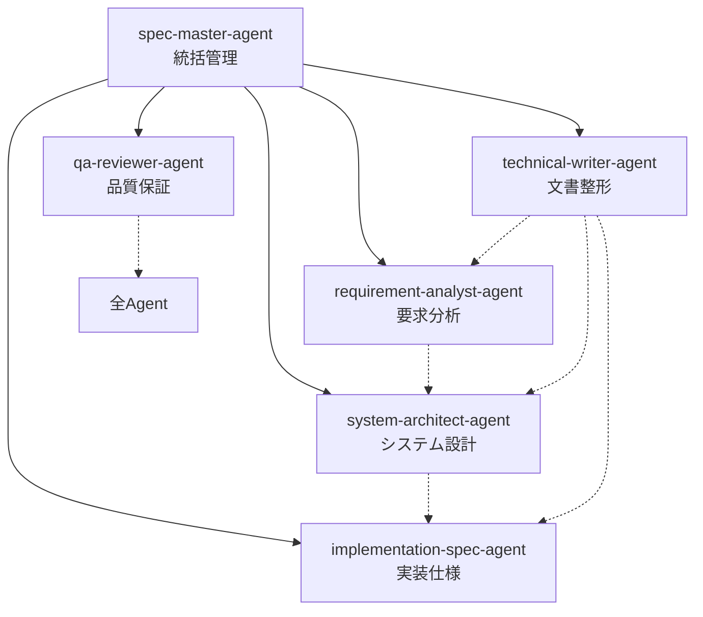

# Spec Agent System - 汎用仕様書作成エージェント群

*バージョン: v2.0.0*
*最終更新: 2025年01月25日 00:30 JST*

🚀 **ソフトウェア開発の仕様書作成を自動化・体系化するマルチエージェントシステム**

## 📌 概要

Spec Agent System は、Claude Code CLI 上で動作する6つの専門AIエージェントが協調して、要求分析から実装仕様、品質レビューまでを一貫してサポートする革新的な仕様書作成システムです。

### ✨ 主な特徴

| 特徴 | 説明 |
|------|------|
| 🤖 **専門性の高い分業体制** | 6つの専門エージェントが各フェーズを担当 |
| 📝 **段階的詳細化** | 要求から実装まで段階的に仕様を詳細化 |
| ✅ **品質保証の内蔵** | レビューエージェントによる自動品質チェック |
| 🎯 **汎用性** | Web、モバイル、デスクトップ、組込みなど全分野対応 |
| 🔄 **自動進捗管理** | progress.mdによるリアルタイム進捗追跡 |
| 📚 **豊富なテンプレート** | 実践的なテンプレートを多数内蔵 |

## 🏗️ システム構成

### エージェント構成図



### 各エージェントの役割

| エージェント | 主要責務 | 成果物 |
|-------------|---------|--------|
| **spec-master-agent** | プロセス全体の統括・進捗管理 | progress.md, todo.md |
| **requirement-analyst-agent** | 要求の収集・分析・整理 | requirement_spec.md |
| **system-architect-agent** | アーキテクチャ・データモデル設計 | architecture_design.md, data_model.md |
| **implementation-spec-agent** | API・実装詳細仕様定義 | implementation_spec.md, api_spec.md |
| **technical-writer-agent** | ドキュメント整形・統一 | 全仕様書の整形版 |
| **qa-reviewer-agent** | 品質レビュー・検証 | review_report.md |

## 🚀 クイックスタート

### 前提条件

- Node.js 14.0以上
- npm または yarn
- Claude Code CLI インストール済み

### インストール

```bash
# Claude Code CLI のインストール（未インストールの場合）
npm install -g @anthropic-ai/claude-code

# Spec Agent のインストール
python install.py
# または
./install.sh  # Linux/macOS
install.bat   # Windows
```

### 基本的な使い方

```bash
# 1. プロジェクトディレクトリに移動
cd my-project

# 2. Claude Code を起動
claude

# 3. マスターエージェントを呼び出し
@spec-master-agent ECサイトの仕様書を作成したいです

# 4. 対話的に仕様書を作成
# エージェントの質問に答えていくだけで仕様書が完成
```

## 📚 ドキュメント

| ドキュメント | 内容 | 対象読者 |
|-------------|------|----------|
| [📖 INSTALLATION.md](INSTALLATION.md) | 詳細なインストール手順 | 初期セットアップ担当者 |
| [📘 USAGE.md](USAGE.md) | 使い方の完全ガイド | 全ユーザー |
| [🔧 API_REFERENCE.md](API_REFERENCE.md) | エージェントAPI仕様 | 開発者・カスタマイズ担当者 |
| [👥 CONTRIBUTING.md](CONTRIBUTING.md) | 貢献ガイドライン | コントリビューター |
| [📝 CHANGELOG.md](CHANGELOG.md) | 変更履歴 | 全ユーザー |
| [📚 manual.md](manual.md) | 実践マニュアル | パワーユーザー |
| [🤖 CLAUDE.md](CLAUDE.md) | Claude Code統合ガイド | Claude Code利用者 |

## 📁 プロジェクト構造

```
spec-agent/
├── 📄 Agent定義ファイル
│   ├── spec-master-agent.md
│   ├── requirement-analyst-agent.md
│   ├── system-architect-agent.md
│   ├── implementation-spec-agent.md
│   ├── technical-writer-agent.md
│   └── qa-reviewer-agent.md
├── ⚙️ 設定・ルール
│   └── coordination_rules.yaml
├── 🔧 インストーラー
│   ├── install.py           # セキュリティ強化版インストーラー
│   ├── install.py           # 標準インストーラー
│   ├── install.sh           # Unix系用
│   ├── install.bat          # Windows用
│   └── uninstall.py         # アンインストーラー
├── 📋 プロジェクト管理
│   ├── progress.md          # 進捗管理
│   └── todo.md             # タスク管理
├── 📚 ドキュメント
│   ├── README.md           # このファイル
│   ├── INSTALLATION.md     # インストールガイド
│   ├── USAGE.md           # 使用ガイド
│   ├── API_REFERENCE.md   # API仕様
│   ├── CONTRIBUTING.md    # 貢献ガイド
│   ├── CHANGELOG.md       # 変更履歴
│   ├── manual.md          # 詳細マニュアル
│   └── CLAUDE.md          # Claude統合ガイド
└── 📂 生成物（実行時作成）
    └── specifications/     # 生成される仕様書
```

## 🎯 対応プロジェクトタイプ

- **Webアプリケーション**: SPA、MPA、JAMstack
- **モバイルアプリ**: iOS、Android、クロスプラットフォーム
- **デスクトップアプリ**: Windows、macOS、Linux
- **API/バックエンド**: REST、GraphQL、gRPC
- **組込みシステム**: IoT、ファームウェア
- **AI/ML**: モデル開発、データパイプライン
- **ブロックチェーン**: DApps、スマートコントラクト

## 🛠️ カスタマイズ

エージェントの動作は各`.md`ファイルを編集することでカスタマイズ可能です：

```bash
# ユーザーレベルのカスタマイズ
~/.claude/agents/spec-agent/[agent-name].md

# プロジェクトレベルのカスタマイズ
./.claude/agents/[agent-name].md
```

## 🤝 コントリビューション

貢献を歓迎します！詳細は [CONTRIBUTING.md](CONTRIBUTING.md) をご覧ください。

### 貢献方法

1. このリポジトリをフォーク
2. フィーチャーブランチを作成 (`git checkout -b feature/AmazingFeature`)
3. 変更をコミット (`git commit -m 'Add some AmazingFeature'`)
4. ブランチにプッシュ (`git push origin feature/AmazingFeature`)
5. プルリクエストを作成

## 📄 ライセンス

MIT License - 詳細は [LICENSE](LICENSE) ファイルを参照

## 🔗 関連リンク

- [Claude Code CLI](https://github.com/anthropic-ai/claude-code)
- [プロジェクトホームページ](https://github.com/KEIEI-NET/spec-agent)
- [問題報告](https://github.com/KEIEI-NET/spec-agent/issues)
- [ディスカッション](https://github.com/KEIEI-NET/spec-agent/discussions)

## 📞 サポート

- **Issues**: [GitHub Issues](https://github.com/KEIEI-NET/spec-agent/issues)
- **Email**: support@keiei.net
- **Discord**: [Spec Agent Community](https://discord.gg/spec-agent)

---

*最終更新: 2025年01月25日 00:30 JST*
*バージョン: v2.0.0*

**更新履歴:**
- v2.0.0 (2025年01月25日): ドキュメント全面改訂、視覚的要素の追加、構造の最適化