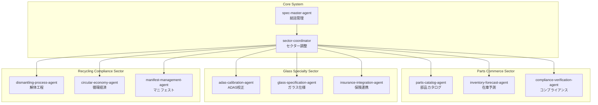

# Spec Agent After - 自動車アフターマーケット業界向け仕様書自動作成システム

*バージョン: v1.0.0*
*最終更新: 2025年09月01日 16:30 JST*

🚗 **自動車アフターマーケット業界に特化した法規制準拠・業界標準対応の仕様書自動作成システム**

## 📌 概要

Spec Agent After は、自動車アフターマーケット業界に特化した仕様書自動作成システムです。部品商社、ガラス専門店、リサイクル業界など、各セクターの固有要件と法規制に完全対応し、業界標準規格（JAPIA-EDI、ADAS、JARC等）と連携した高品質な仕様書を生成します。

### 🚗 対象業界セクター

| セクター | 主要機能 | 準拠法規・標準 |
|---------|---------|--------------|
| 🔧 **部品商社** | 部品カタログ管理、在庫予測、コンプライアンス検証 | PL法、IATF 16949、JAPIA-EDI |
| 🪟 **ガラス専門** | ADAS校正、ガラス仕様管理、保険連携 | JIS R 3211/3212、ECE R43、ADAS規制 |
| ♻️ **リサイクル** | 解体工程管理、循環経済支援、マニフェスト管理 | 自動車リサイクル法、フロン法、EV電池法 |

### ✨ 主な特徴

| 特徴 | 説明 |
|------|------|
| 🎯 **業界特化型** | 自動車アフターマーケットの固有要件に完全対応 |
| 📋 **法規制準拠** | 各セクターの法令・業界標準を完全網羅 |
| 🔗 **システム連携** | JAPIA-EDI、JARC-API、保険会社API等との連携仕様 |
| 🌐 **循環経済対応** | カーボンフットプリント追跡、サーキュラーエコノミー支援 |
| 🚀 **将来技術対応** | EV/FCV、ADAS/自動運転、新素材への拡張性確保 |
| 📚 **豊富なテンプレート** | 業界標準に準拠した仕様書テンプレート内蔵 |

## 🏗️ システム構成

### モジュラーアーキテクチャ



### セクター別エージェント一覧

#### 🔧 部品商社セクター
| エージェント | 主要機能 | 生成仕様書 |
|-------------|---------|-----------|
| **parts-catalog-agent** | 部品マスター管理、互換性DB、価格設定 | 部品カタログシステム仕様書 |
| **inventory-forecast-agent** | AI需要予測、在庫最適化、補充計画 | 在庫予測システム仕様書 |
| **compliance-verification-agent** | PL法準拠、IATF認証、品質保証 | コンプライアンス管理仕様書 |

#### 🪟 ガラス専門セクター
| エージェント | 主要機能 | 生成仕様書 |
|-------------|---------|-----------|
| **adas-calibration-agent** | ADAS校正手順、機器管理、認証記録 | ADAS校正システム仕様書 |
| **glass-specification-agent** | ガラス種別管理、JIS/ECE準拠、品質管理 | ガラス仕様管理システム仕様書 |
| **insurance-integration-agent** | 直接請求、査定支援、不正防止 | 保険連携システム仕様書 |

#### ♻️ リサイクルセクター
| エージェント | 主要機能 | 生成仕様書 |
|-------------|---------|-----------|
| **dismantling-process-agent** | 解体工程管理、有害物質処理、EV電池対応 | 解体工程管理システム仕様書 |
| **circular-economy-agent** | 資源循環最適化、カーボン管理、持続可能性評価 | 循環経済支援システム仕様書 |
| **manifest-management-agent** | 電子マニフェスト、JWNET連携、追跡管理 | マニフェスト管理システム仕様書 |

## 🚀 クイックスタート

### 前提条件

- Node.js 14.0以上
- npm または yarn
- Claude Code CLI インストール済み

### インストール

```bash
# Claude Code CLI のインストール（未インストールの場合）
npm install -g @anthropic-ai/claude-code

# Spec Agent のインストール
python install.py
# または
./install.sh  # Linux/macOS
install.bat   # Windows
```

### 基本的な使い方

```bash
# 1. プロジェクトディレクトリに移動
cd my-project

# 2. Claude Code を起動
claude

# 3. マスターエージェントを呼び出し
@spec-master-agent ECサイトの仕様書を作成したいです

# 4. 対話的に仕様書を作成
# エージェントの質問に答えていくだけで仕様書が完成
```

## 📚 ドキュメント

| ドキュメント | 内容 | 対象読者 |
|-------------|------|----------|
| [📖 INSTALLATION.md](INSTALLATION.md) | 詳細なインストール手順 | 初期セットアップ担当者 |
| [📘 USAGE.md](USAGE.md) | 使い方の完全ガイド | 全ユーザー |
| [🔧 API_REFERENCE.md](API_REFERENCE.md) | エージェントAPI仕様 | 開発者・カスタマイズ担当者 |
| [👥 CONTRIBUTING.md](CONTRIBUTING.md) | 貢献ガイドライン | コントリビューター |
| [📝 CHANGELOG.md](CHANGELOG.md) | 変更履歴 | 全ユーザー |
| [📚 manual.md](manual.md) | 実践マニュアル | パワーユーザー |
| [🤖 CLAUDE.md](CLAUDE.md) | Claude Code統合ガイド | Claude Code利用者 |

## 📁 プロジェクト構造

```
spec-agent-after/
├── 📄 Core Agents（基本エージェント）
│   ├── spec-master-agent.md
│   ├── requirement-analyst-agent.md
│   ├── system-architect-agent.md
│   ├── implementation-spec-agent.md
│   ├── technical-writer-agent.md
│   └── qa-reviewer-agent.md
├── 🏭 Sector Modules（業界別モジュール）
│   ├── sector-coordinator.yaml      # セクター間調整設定
│   ├── parts-commerce/              # 部品商社セクター
│   │   ├── agents/
│   │   │   ├── parts-catalog-agent.md
│   │   │   ├── inventory-forecast-agent.md
│   │   │   └── compliance-verification-agent.md
│   │   └── regulations/
│   │       ├── pl-law.yaml
│   │       └── iatf16949.yaml
│   ├── glass-specialty/             # ガラス専門セクター
│   │   ├── agents/
│   │   │   ├── adas-calibration-agent.md
│   │   │   ├── glass-specification-agent.md
│   │   │   └── insurance-integration-agent.md
│   │   └── regulations/
│   │       ├── adas-regulation.yaml
│   │       └── ece-r43.yaml
│   └── recycling-compliance/        # リサイクルセクター
│       ├── agents/
│       │   ├── dismantling-process-agent.md
│       │   ├── circular-economy-agent.md
│       │   └── manifest-management-agent.md
│       └── regulations/
│           ├── auto-recycling-law.yaml
│           ├── freon-law.yaml
│           └── ev-battery-law.yaml
├── 🔗 Cross-Sector Functions（横断機能）
│   ├── supply-chain-integration.yaml
│   ├── carbon-footprint-tracker.yaml
│   └── circular-economy-metrics.yaml
├── ⚙️ 設定・ルール
│   └── coordination_rules.yaml
├── 📋 プロジェクト管理
│   ├── progress.md
│   └── todo.md
├── 📚 ドキュメント
│   ├── README.md           # このファイル
│   ├── INSTALLATION.md
│   ├── USAGE.md
│   └── CLAUDE.md
└── 📂 生成物（実行時作成）
    └── specifications/     # 生成される仕様書
```

## 🎯 生成可能な仕様書タイプ

### 部品商社向け仕様書
- **部品カタログ管理システム仕様書**: マスターデータ管理、互換性DB、価格設定
- **在庫予測システム仕様書**: AI需要予測、発注最適化、リードタイム管理
- **コンプライアンス管理仕様書**: PL法対応、品質保証体制、認証管理

### ガラス専門店向け仕様書
- **ADAS校正システム仕様書**: 校正手順管理、機器認証、作業記録
- **ガラス仕様管理システム仕様書**: 型式DB、品質基準、在庫管理
- **保険連携システム仕様書**: 直接請求、査定支援、不正防止

### リサイクル業界向け仕様書
- **解体工程管理システム仕様書**: 工程最適化、有害物質処理、EV対応
- **循環経済支援システム仕様書**: 資源フロー、カーボン管理、KPI測定
- **電子マニフェストシステム仕様書**: JWNET連携、追跡管理、法令遵守

## 🛠️ カスタマイズ

エージェントの動作は各`.md`ファイルを編集することでカスタマイズ可能です：

```bash
# ユーザーレベルのカスタマイズ
~/.claude/agents/spec-agent/[agent-name].md

# プロジェクトレベルのカスタマイズ
./.claude/agents/[agent-name].md
```

## 🤝 コントリビューション

貢献を歓迎します！詳細は [CONTRIBUTING.md](CONTRIBUTING.md) をご覧ください。

### 貢献方法

1. このリポジトリをフォーク
2. フィーチャーブランチを作成 (`git checkout -b feature/AmazingFeature`)
3. 変更をコミット (`git commit -m 'Add some AmazingFeature'`)
4. ブランチにプッシュ (`git push origin feature/AmazingFeature`)
5. プルリクエストを作成

## 📄 ライセンス

MIT License - 詳細は [LICENSE](LICENSE) ファイルを参照

## 🔗 関連リンク

- [Claude Code CLI](https://github.com/anthropic-ai/claude-code)
- [プロジェクトホームページ](https://github.com/KEIEI-NET/spec-agent)
- [問題報告](https://github.com/KEIEI-NET/spec-agent/issues)
- [ディスカッション](https://github.com/KEIEI-NET/spec-agent/discussions)

## 📞 サポート

- **Issues**: [GitHub Issues](https://github.com/KEIEI-NET/spec-agent/issues)
- **Email**: support@keiei.net
- **Discord**: [Spec Agent Community](https://discord.gg/spec-agent)

---

*最終更新: 2025年01月25日 17:00 JST*
*バージョン: v1.0.0*

**更新履歴:**
- v1.0.0 (2025年01月25日): 自動車アフターマーケット業界特化版として新規リリース