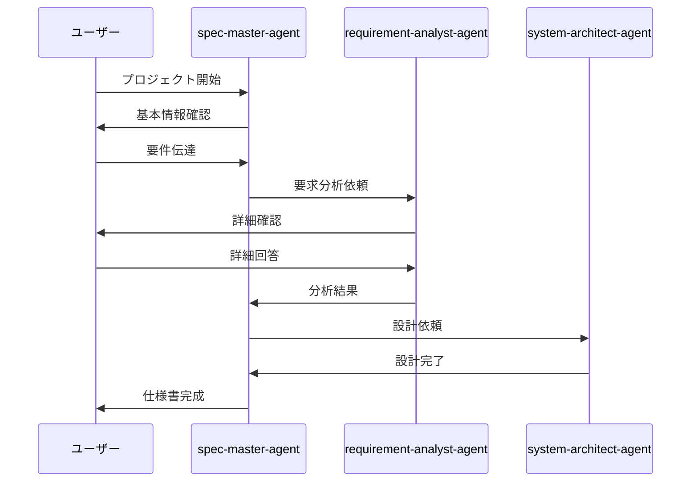
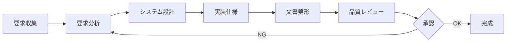
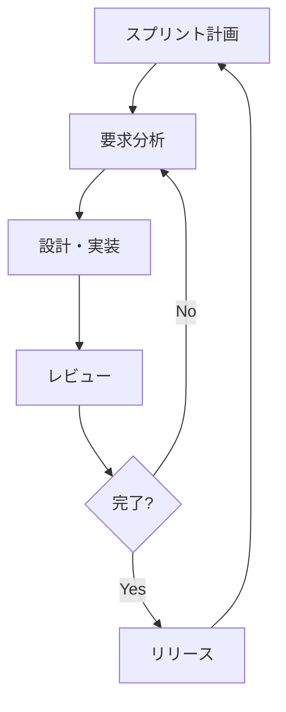
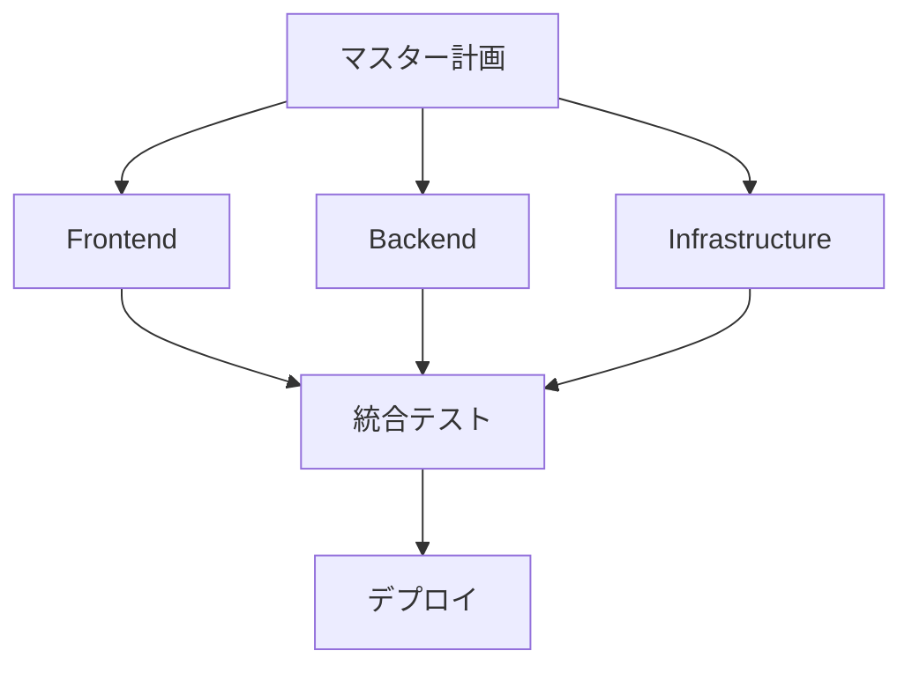

# Usage Guide - 使用ガイド

*バージョン: v1.0.0*
*最終更新: 2025年01月25日 17:45 JST*

## 📌 概要

Spec Agent After（自動車アフターマーケット業界向け仕様書作成システム）の詳細な使用方法を説明します。このガイドでは、部品商社、ガラス専門店、リサイクル業界の各セクター別の使い方、業界固有の要件対応、法規制準拠の仕様書作成方法を解説します。

## 📚 目次

1. [基本的な使い方](#基本的な使い方)
2. [セクター別使用ガイド](#セクター別使用ガイド)
   - [部品商社セクター](#部品商社セクター)
   - [ガラス専門セクター](#ガラス専門セクター)
   - [リサイクルセクター](#リサイクルセクター)
3. [法規制・業界標準対応](#法規制業界標準対応)
4. [実践的な使用例](#実践的な使用例)
5. [統合システム仕様書作成](#統合システム仕様書作成)
6. [ベストプラクティス](#ベストプラクティス)

---

## 🎯 基本的な使い方

### 1. 初期セットアップ

```bash
# プロジェクトディレクトリの作成
mkdir my-awesome-project
cd my-awesome-project

# Claude Code の起動
claude

# 初期化
@spec-master-agent プロジェクトを初期化してください
```

### 2. エージェントの呼び出し方法

#### 方法1: @メンション（推奨）

```
@spec-master-agent 部品商社向け在庫管理システムの仕様書を作成したいです
```

#### 方法2: セクター専門エージェント直接呼び出し

```
@parts-catalog-agent 部品マスターデータ管理システムの仕様を詳細に
```

#### 方法3: 複数エージェントの連携

```
@spec-master-agent と @requirement-analyst-agent で要求を整理してください
```

### 3. 基本的な対話フロー



---

## 🏭 セクター別使用ガイド

### 🔧 部品商社セクター

#### 1. parts-catalog-agent（部品カタログ管理）

##### 役割
- 部品マスターデータ管理システムの設計
- OEM互換性データベースの構築
- JAPIA-EDI連携仕様の定義

##### 使用例

```
You: @parts-catalog-agent トヨタ・ホンダ・日産対応の部品カタログシステムを作りたい

Agent: 部品カタログ管理システムの仕様を作成します。

**システム要件**
□ OEM対応
  - トヨタ部品番号体系（10-12桁）
  - ホンダ部品番号体系（5-5-5形式）
  - 日産部品番号体系（5桁-5桁形式）

□ データ管理
  - 純正部品番号
  - 優良部品互換番号
  - 適合車種データ（年式・型式・グレード）
  - 在庫連動・価格設定

□ 法規制対応
  - PL法に基づく品質保証情報
  - IATF 16949準拠のトレーサビリティ
```

### 2. requirement-analyst-agent（要求分析）

#### 役割
- ビジネス要求の収集と整理
- 機能要求・非機能要求の定義
- ユースケースの作成

#### 使用例

```
You: @requirement-analyst-agent ユーザー認証機能の要求を分析してください

Analyst: ユーザー認証機能の要求分析を開始します。

**機能要求**
□ 認証方式
  - メール/パスワード認証
  - ソーシャルログイン（Google, Facebook, etc）
  - 二要素認証（2FA）

□ セキュリティ要求
  - パスワードポリシー
  - セッション管理
  - アカウントロック機能

□ ユーザー体験
  - パスワードリセット
  - 記憶機能（Remember Me）
  - シングルサインオン（SSO）

各項目について詳細を確認していきます。
```

### 3. system-architect-agent（システム設計）

#### 役割
- システムアーキテクチャの設計
- データモデルの定義
- 技術スタックの選定

#### 使用例

```
You: @system-architect-agent マイクロサービスアーキテクチャを設計してください

Architect: マイクロサービスアーキテクチャを設計します。

**推奨構成**
```yaml
services:
  - name: API Gateway
    tech: Kong/Nginx
    role: ルーティング、認証、レート制限
    
  - name: User Service
    tech: Node.js/Express
    database: PostgreSQL
    role: ユーザー管理、認証
    
  - name: Product Service
    tech: Python/FastAPI
    database: MongoDB
    role: 商品管理、在庫管理
    
  - name: Order Service
    tech: Java/Spring Boot
    database: PostgreSQL
    role: 注文処理、決済連携
```

**通信方式**
- 同期: REST API
- 非同期: RabbitMQ/Kafka
```

### 4. implementation-spec-agent（実装仕様）

#### 役割
- API仕様の定義
- データベーススキーマの設計
- 実装詳細の記述

#### 使用例

```
You: @implementation-spec-agent REST APIの仕様を作成してください

Implementation: REST API仕様を定義します。

**エンドポイント設計**

### ユーザー管理

```http
POST /api/v1/users
Content-Type: application/json

{
  "email": "user@example.com",
  "password": "SecurePassword123!",
  "name": "山田太郎"
}

Response: 201 Created
{
  "id": "550e8400-e29b-41d4-a716-446655440000",
  "email": "user@example.com",
  "name": "山田太郎",
  "created_at": "2025-01-25T00:30:00Z"
}
```

### 認証

```http
POST /api/v1/auth/login
Content-Type: application/json

{
  "email": "user@example.com",
  "password": "SecurePassword123!"
}

Response: 200 OK
{
  "access_token": "eyJhbGciOiJIUzI1NiIs...",
  "refresh_token": "dGhpc2lzYXJlZnJlc2h0b2tlbg==",
  "expires_in": 3600
}
```
```

### 5. technical-writer-agent（文書整形）

#### 役割
- ドキュメントの整形と統一
- 用語の一貫性確保
- 図表の作成

#### 使用例

```
You: @technical-writer-agent 仕様書を整形してください

Writer: 仕様書の整形を開始します。

**実施内容**
✅ 用語統一
  - "ユーザ" → "ユーザー"
  - "ログイン" → "サインイン"（統一）

✅ 章立て調整
  - 目次の自動生成
  - セクション番号の付与
  - 相互参照の設定

✅ 図表追加
  - システム構成図（mermaid）
  - ER図
  - シーケンス図

✅ フォーマット統一
  - コードブロックの言語指定
  - 表形式の統一
  - マークダウン記法の統一
```

### 6. qa-reviewer-agent（品質レビュー）

#### 役割
- 仕様書の完全性チェック
- 整合性の検証
- 改善提案

#### 使用例

```
You: @qa-reviewer-agent 仕様書をレビューしてください

QA: 品質レビューを実施します。

**レビュー結果**

✅ 良好な点
- 要求の網羅性: 95%
- ドキュメントの可読性: 高
- 技術的正確性: 適切

⚠️ 要改善点

1. **セキュリティ仕様**
   - 問題: OWASP Top 10への対応が不明確
   - 推奨: セキュリティチェックリストの追加

2. **パフォーマンス目標**
   - 問題: 具体的な数値目標なし
   - 推奨: レスポンスタイム < 200ms など

3. **エラーハンドリング**
   - 問題: エラーコード体系が未定義
   - 推奨: 統一エラーコード表の作成

改善優先度: 高
```

---

## 💡 実践的な使用例

### 例1: ECサイト開発

```bash
# Step 1: プロジェクト開始
@spec-master-agent ECサイトの仕様書を作成します

# Step 2: 要求定義
商品数1000点、月間10万PV、B2C向け

# Step 3: アーキテクチャ選定
クラウドネイティブ、マイクロサービス希望

# Step 4: 実装仕様
REST API、React フロントエンド

# Step 5: レビュー
@qa-reviewer-agent 全体をレビューしてください
```

### 例2: 社内システム刷新

```bash
# Step 1: 現状分析
@requirement-analyst-agent 既存システムの課題を整理

# Step 2: 移行計画
@system-architect-agent 段階的移行アーキテクチャを設計

# Step 3: 詳細設計
@implementation-spec-agent APIマイグレーション仕様作成

# Step 4: ドキュメント化
@technical-writer-agent 移行ガイドを作成
```

### 例3: モバイルアプリMVP

```bash
# Step 1: 高速プロトタイピング
@spec-master-agent 2週間でMVPを作りたい

# Step 2: 最小機能定義
ユーザー登録、基本CRUD、プッシュ通知のみ

# Step 3: 技術選定
React Native、Firebase使用

# Step 4: 実装優先順位
@implementation-spec-agent クリティカルパスを定義
```

---

## 🔄 ワークフロー構築

### 標準ワークフロー



### アジャイル対応ワークフロー



### 並行開発ワークフロー



---

## 🚀 高度な使い方

### 1. カスタムテンプレート作成

```bash
# テンプレートディレクトリ作成
mkdir -p .claude/templates

# カスタムテンプレート作成
cat > .claude/templates/custom_spec.md << EOF
# [プロジェクト名] 仕様書

## 独自セクション1
## 独自セクション2
EOF

# エージェントに適用
@spec-master-agent カスタムテンプレートを使用してください
```

### 2. CI/CD統合

```yaml
# .github/workflows/spec-review.yml
name: Spec Review

on:
  pull_request:
    paths:
      - 'specifications/**'

jobs:
  review:
    runs-on: ubuntu-latest
    steps:
      - uses: actions/checkout@v2
      - name: Run Spec Agent Review
        run: |
          claude run "@qa-reviewer-agent review all specs"
```

### 3. 複数プロジェクト管理

```bash
# プロジェクト切り替え
claude project switch project-a
@spec-master-agent プロジェクトAの進捗確認

claude project switch project-b
@spec-master-agent プロジェクトBの進捗確認
```

---

## 📋 ベストプラクティス

### ✅ DO - 推奨事項

1. **段階的な詳細化**
   - 概要から始めて徐々に詳細化
   - 各段階で確認とフィードバック

2. **明確な要件定義**
   - 曖昧な表現を避ける
   - 具体的な数値目標を設定

3. **定期的なレビュー**
   - 各フェーズ完了時にレビュー
   - 早期の問題発見と修正

4. **ドキュメント管理**
   - バージョン管理の徹底
   - 変更履歴の記録

### ❌ DON'T - 避けるべき事項

1. **一度に全て作成**
   - 巨大な仕様書の一括作成
   - フィードバックなしの進行

2. **技術先行**
   - 要求分析前の技術選定
   - ビジネス要求の軽視

3. **レビュー省略**
   - 品質チェックのスキップ
   - ステークホルダー確認の省略

---

## 📊 パフォーマンス最適化

### 効率的な使い方

| 状況 | 推奨方法 | 時間短縮 |
|------|---------|----------|
| 小規模プロジェクト | 直接実装仕様から開始 | 50% |
| 大規模プロジェクト | フェーズ分割実行 | 30% |
| アジャイル開発 | イテレーティブ実行 | 40% |
| レガシー刷新 | 段階的移行計画 | 60% |

### トラブルシューティング

| 問題 | 原因 | 解決方法 |
|------|------|---------|
| 応答が遅い | コンテキスト過多 | セッションリセット |
| 不整合発生 | 並行編集 | 順次実行に変更 |
| 仕様漏れ | レビュー不足 | QAエージェント活用 |

---

## 🔗 関連リソース

- [API Reference](API_REFERENCE.md) - 詳細なAPI仕様
- [Contributing Guide](CONTRIBUTING.md) - 開発参加ガイド
- [Manual](manual.md) - 詳細マニュアル
- [Installation](INSTALLATION.md) - インストールガイド

---

*最終更新: 2025年01月25日 00:30 JST*
*バージョン: v2.0.0*

**更新履歴:**
- v2.0.0 (2025年01月25日): 初版作成、実践的な使用例とワークフロー図を追加