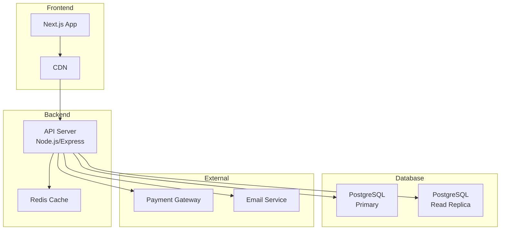
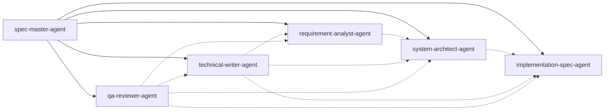

# Manual - 実践マニュアル

*バージョン: v2.0.1*
*最終更新: 2025年01月25日 00:30 JST*

# Spec Agent System 実践マニュアル

## 📚 目次

1. [🎯 はじめに](#はじめに)
2. [⚙️ クイックセットアップ](#クイックセットアップ)
3. [📝 フェーズ別詳細手順](#フェーズ別詳細手順)
4. [🔄 Agent間の連携](#agent間の連携)
5. [💡 実践例](#実践例)
6. [🔧 トラブルシューティング](#トラブルシューティング)
7. [✨ ベストプラクティス](#ベストプラクティス)
8. [📄 テンプレート集](#テンプレート集)

---

## 🎯 はじめに

本マニュアルは、Spec Agent System を使用して実践的にソフトウェア仕様書を作成するための完全ガイドです。

### ⚡ クイックリファレンス

- **初めての方**: [クイックセットアップ](#クイックセットアップ)から始めてください
- **経験者の方**: [実践例](#実践例)を参照してください
- **問題解決**: [トラブルシューティング](#トラブルシューティング)を確認してください

### 📊 システムの特徴

| 特徴 | 説明 | メリット |
|------|------|----------|
| **6つの専門エージェント** | 各分野のエキスパートAI | 高品質な成果物 |
| **段階的詳細化** | 概要から詳細へ | 漏れのない仕様 |
| **自動品質保証** | 内蔵レビュー機能 | ミスの削減 |
| **汎用性** | あらゆる開発に対応 | 幅広い適用 |

---

## ⚙️ クイックセットアップ

### 🚀 3分で始める

```bash
# 1. Spec Agent のインストール（約1分）
python install.py

# 2. プロジェクトディレクトリへ移動
cd my-project

# 3. Claude Code を起動
claude

# 4. エージェントを呼び出し
@spec-master-agent プロジェクトを開始します
```

### 📦 インストール後の構成

```
プロジェクト/
├── 📁 .claude/
│   ├── agents/          # エージェント定義
│   └── project.json     # プロジェクト設定
├── 📂 specifications/    # 生成される仕様書
├── 📋 progress.md        # 進捗管理
└── ✅ todo.md            # タスク管理
```

---


---

## 📝 フェーズ別詳細手順

### 🔍 フェーズ1: 要求分析（推奨: 3-5日）

#### Step 1.1: プロジェクト概要の把握
```
You: B2C向けで、商品数は約1000点、月間10万PVを想定。予算は中規模で納期は3ヶ月です。

Claude (as spec-master-agent): 了解しました。中規模B2C ECサイトですね。
requirement-analyst-agentと連携して要求分析を開始します。

[requirement-analyst-agentの視点で応答]

要求を詳細に確認していきます：

**機能要求の確認**
□ 商品管理
  - カテゴリ分類は何階層必要ですか？
  - 商品画像は何枚まで登録可能にしますか？
  - 在庫管理は必要ですか？（リアルタイム？バッチ？）

□ ユーザー機能
  - 会員登録は必須ですか？
  - ゲスト購入は可能にしますか？
  - お気に入り機能は必要ですか？

□ 決済・配送
  - 対応する決済方法は？
  - 配送料金の計算ルールは？
  - ポイント制度は導入しますか？

specifications/requirement_spec.mdに順次記録していきます。
```

#### Step 1.2: 非機能要求の確認
```
You: 在庫はリアルタイム管理、会員登録は任意、決済はクレジットカードと代引きで。

Claude (as requirement-analyst-agent): 機能要求を記録しました。
次に非機能要求を確認します：

**パフォーマンス要求**
- ページ表示: 3秒以内が望ましい
- 同時接続: 1000ユーザーを想定
- 月間10万PVなら問題ないでしょう

**セキュリティ要求**
- SSL/TLS必須
- PCI DSS準拠（クレジットカード）
- 個人情報保護

**可用性要求**
- 稼働率: 99.5%以上推奨
- 計画停止: 月1回深夜帯

これらでよろしいですか？
特別な要求があれば追加します。
```

### 🏗️ フェーズ2: システム設計（推奨: 5-7日）

#### Step 2.1: アーキテクチャ設計
```
You: @system-architect-agent 要求仕様に基づいてアーキテクチャを設計してください

Claude (as system-architect-agent): requirement_spec.mdを確認しました。
中規模B2C ECサイトに適したアーキテクチャを設計します。

**推奨アーキテクチャ**


**技術スタック**
- Frontend: Next.js (SSG/ISR対応)
- Backend: Node.js + Express
- Database: PostgreSQL
- Cache: Redis
- Infrastructure: AWS

specifications/architecture_design.mdに詳細を記載しました。
```

#### Step 2.2: データモデル設計
```
You: データモデルも設計してください

Claude (as system-architect-agent): 主要エンティティのデータモデルを設計します。

**主要テーブル設計**

1. **users（ユーザー）**
   - id: UUID
   - email: VARCHAR(255) UNIQUE
   - password_hash: VARCHAR(255)
   - name: VARCHAR(100)
   - created_at: TIMESTAMP

2. **products（商品）**
   - id: UUID
   - name: VARCHAR(255)
   - description: TEXT
   - price: DECIMAL(10,2)
   - stock_quantity: INTEGER
   - category_id: UUID

3. **orders（注文）**
   - id: UUID
   - user_id: UUID
   - total_amount: DECIMAL(10,2)
   - status: ENUM
   - created_at: TIMESTAMP

4. **order_items（注文明細）**
   - id: UUID
   - order_id: UUID
   - product_id: UUID
   - quantity: INTEGER
   - unit_price: DECIMAL(10,2)

specifications/data_model.mdにER図と詳細を記載しました。
```

### ⚙️ フェーズ3: 実装仕様（推奨: 5-7日）

#### Step 3.1: API設計
```
You: @implementation-spec-agent API仕様を作成してください

Claude (as implementation-spec-agent): アーキテクチャ設計に基づいてREST API仕様を作成します。

**API エンドポイント設計**

### 認証関連
- POST /api/auth/register - ユーザー登録
- POST /api/auth/login - ログイン
- POST /api/auth/logout - ログアウト
- GET /api/auth/me - 現在のユーザー情報

### 商品関連
- GET /api/products - 商品一覧
- GET /api/products/:id - 商品詳細
- GET /api/products/search - 商品検索
- GET /api/categories - カテゴリ一覧

### カート関連
- GET /api/cart - カート内容取得
- POST /api/cart/items - カートに追加
- PUT /api/cart/items/:id - 数量更新
- DELETE /api/cart/items/:id - カートから削除

### 注文関連
- POST /api/orders - 注文作成
- GET /api/orders - 注文履歴
- GET /api/orders/:id - 注文詳細

specifications/api_spec.mdに詳細仕様を記載しました。
各エンドポイントにリクエスト/レスポンス例も含めています。
```

#### Step 3.2: 実装詳細仕様
```
You: 主要な処理の実装仕様も作成してください

Claude (as implementation-spec-agent): 主要処理の実装仕様を定義します。

**在庫管理処理**
```javascript
// 在庫確認と更新（トランザクション処理）
async function updateStock(orderId, orderItems) {
  const client = await pool.connect();
  try {
    await client.query('BEGIN');
    
    // 1. 在庫確認
    for (const item of orderItems) {
      const result = await client.query(
        'SELECT stock_quantity FROM products WHERE id = $1 FOR UPDATE',
        [item.productId]
      );
      
      if (result.rows[0].stock_quantity < item.quantity) {
        throw new InsufficientStockError(item.productId);
      }
    }
    
    // 2. 在庫更新
    for (const item of orderItems) {
      await client.query(
        'UPDATE products SET stock_quantity = stock_quantity - $1 WHERE id = $2',
        [item.quantity, item.productId]
      );
    }
    
    await client.query('COMMIT');
  } catch (e) {
    await client.query('ROLLBACK');
    throw e;
  } finally {
    client.release();
  }
}
```

specifications/implementation_spec.mdに記載しました。
```

### 📝 フェーズ4: ドキュメント整形（推奨: 2-3日）

```
You: @technical-writer-agent 作成した仕様書を整形してください

Claude (as technical-writer-agent): 各仕様書を確認して整形します。

**整形実施内容**
1. ✅ 用語の統一
   - "ユーザー" → "ユーザー"（"利用者"を統一）
   - "商品" → "商品"（"製品"を統一）

2. ✅ 章立ての調整
   - 各文書に目次を追加
   - セクション番号を統一

3. ✅ 図表の追加
   - アーキテクチャ図をmermaidで作成
   - API仕様に表形式を適用

4. ✅ 相互参照の整備
   - 関連文書へのリンクを追加
   - 用語集を作成

specifications/glossary.mdに用語集を作成しました。
各仕様書の整形版を更新しました。
```

### ✅ フェーズ5: 品質レビュー（推奨: 2-3日）

```
You: @qa-reviewer-agent 全仕様書をレビューしてください

Claude (as qa-reviewer-agent): 全仕様書の品質レビューを実施します。

**レビュー結果サマリー**

✅ 良好な点
- 要求の網羅性は十分
- アーキテクチャは要求に適合
- API設計はRESTful原則に準拠

⚠️ 要改善点
1. セキュリティ仕様の詳細化が必要
   - CSRF対策の明記
   - Rate Limitingの設定

2. エラーハンドリングの統一
   - エラーコード体系の定義
   - エラーレスポンス形式の統一

3. テスト仕様の追加
   - 単体テストカバレッジ目標
   - 負荷試験のシナリオ

review/review_report.mdに詳細レポートを作成しました。
改善提案も含めています。
```

---

## 🔄 Agent間の連携

### 連携パターン

#### 1. 逐次連携
```
要求分析 → システム設計 → 実装仕様 → レビュー
```

#### 2. 並行連携
```
You: @technical-writer-agent 要求仕様書を整形しながら、
@system-architect-agent でアーキテクチャ検討を開始してください
```

#### 3. フィードバック連携
```
You: @qa-reviewer-agent のレビュー結果を 
@requirement-analyst-agent にフィードバックしてください
```

### 連携図


---

## 💡 実践例

### 例1: 社内業務システム（勤怠管理）

#### プロジェクト開始
```
You: @spec-master-agent 社内勤怠管理システムを作りたいです。
従業員200名、3拠点での利用を想定しています。

Claude (as spec-master-agent): 社内勤怠管理システムの仕様書作成を開始します。

**プロジェクト概要**
- 種類: 社内業務システム（勤怠管理）
- 規模: 中規模（200名、3拠点）
- 特性: 内部利用、既存システム連携の可能性

requirement-analyst-agentと連携して詳細を確認します。

**確認事項**
1. 現在の勤怠管理方法は？
2. 必要な機能の優先順位は？
   - 打刻（出退勤記録）
   - 申請承認（残業、休暇等）
   - 集計・レポート
   - 給与システム連携
3. 特殊な勤務形態はありますか？
   - フレックスタイム
   - 裁量労働
   - シフト勤務
```

#### 要求の具体化
```
You: 現在はExcelで管理。打刻と集計を自動化したい。
フレックスタイムありで、給与システム連携は必須です。

Claude (as requirement-analyst-agent): 要求を整理します。

**機能要求（優先度順）**
1. [必須] Web打刻機能
   - PC/スマホ対応
   - 位置情報記録（不正防止）
   
2. [必須] 自動集計
   - 日次/月次集計
   - フレックスタイム対応
   - 残業時間自動計算
   
3. [必須] 給与システム連携
   - CSV出力機能
   - 既定フォーマット対応
   
4. [推奨] 申請承認ワークフロー
   - 残業申請
   - 休暇申請
   - 承認ルート設定

specifications/requirement_spec.mdに詳細を記載しました。
次はシステム設計に進みますか？
```

### 例2: スタートアップMVP（マッチングアプリ）

#### 高速プロトタイピング
```
You: @spec-master-agent スタートアップでマッチングアプリのMVPを
2週間で作りたい。最小限の機能で。

Claude (as spec-master-agent): 2週間でのMVP開発ですね。
スピード最優先で進めます。

**MVP戦略**
- スコープ: 必要最小限の機能
- 技術: 実績ある技術スタック
- 品質: 基本機能の動作保証

**コア機能（これだけ実装）**
1. ユーザー登録・ログイン
2. プロフィール作成
3. マッチング（シンプルなアルゴリズム）
4. メッセージ機能

**使用しない機能（Phase 2以降）**
- 課金機能
- 詳細な検索
- プッシュ通知
- AIレコメンド

implementation-spec-agentと連携して、
すぐ実装可能な仕様を作成します。
```

### 例3: エンタープライズシステム（基幹システム刷新）

#### 段階的移行を考慮
```
You: @spec-master-agent 20年使っている基幹システムを
段階的に刷新したい。まず在庫管理モジュールから。

Claude (as spec-master-agent): レガシーシステムの段階的刷新ですね。
リスクを最小化しながら進めます。

**刷新戦略**
1. 現行システム調査
2. 移行対象の切り出し
3. インターフェース設計
4. 並行稼働期間の設計

requirement-analyst-agentと連携して、
現行システムの制約を確認します。

**確認事項**
- 現行システムの技術仕様
- データ移行の要件
- 業務停止可能時間
- 並行稼働期間
- ロールバック計画

慎重に進める必要があるため、
各フェーズでの承認ポイントを明確にします。
```

---

## 🔧 トラブルシューティング

### よくある問題と解決方法

#### 1. Agentが意図した通りに動作しない
```
問題: @spec-master-agent が応答しない

解決方法:
1. Agent名の確認
   正: @spec-master-agent
   誤: @spec-master, @master-agent

2. 明示的な指定
   You: spec-master-agent として動作してください

3. コンテキストのリセット
   You: 新しいセッションとして、spec-master-agentで対応してください
```

#### 2. 仕様書間の不整合
```
問題: 要求仕様とアーキテクチャ設計で内容が異なる

解決方法:
You: @qa-reviewer-agent requirement_spec.mdとarchitecture_design.mdの
整合性をチェックしてください

Claude (as qa-reviewer-agent): 不整合を検出しました：
- requirement_spec.md: リアルタイム在庫更新
- architecture_design.md: バッチ更新設計

推奨対応: アーキテクチャをリアルタイム対応に修正
```

#### 3. 仕様の粒度が不適切
```
問題: 仕様が抽象的すぎる/詳細すぎる

解決方法:
You: @technical-writer-agent この仕様書の詳細度は適切ですか？
想定読者は開発チームです。

Claude (as technical-writer-agent): 確認しました。
開発チーム向けとしては以下の調整が必要です：
- API仕様: もう少し詳細に（パラメータ型、エラーコード）
- アーキテクチャ: 現状で適切
- データモデル: インデックス設計を追加
```

### エラーメッセージ対応表

| エラー | 原因 | 対処法 |
|--------|------|--------|
| "Agent not found" | Agent名の誤り | 正しいAgent名を確認 |
| "Context too large" | 会話履歴が長すぎる | 新しいセッションを開始 |
| "File not found" | ファイルパスの誤り | プロジェクトルートからの相対パス確認 |
| "Permission denied" | ファイルアクセス権限なし | ファイル権限を確認 |

---

## ✨ ベストプラクティス

### 1. プロジェクト開始時
- [ ] プロジェクトの目的と制約を明確にする
- [ ] ステークホルダーを特定する
- [ ] 成功基準を定義する
- [ ] リスクを洗い出す

### 2. 要求分析時
- [ ] 機能要求と非機能要求を分離する
- [ ] 優先順位を明確にする
- [ ] 実現可能性を検証する
- [ ] トレーサビリティを確保する

### 3. 設計時
- [ ] 複数の選択肢を検討する
- [ ] トレードオフを明文化する
- [ ] 将来の拡張性を考慮する
- [ ] 標準やベストプラクティスに従う

### 4. レビュー時
- [ ] チェックリストを使用する
- [ ] 複数の視点でレビューする
- [ ] 改善提案を具体的にする
- [ ] 優先度をつけて対応する

### 5. 全体を通じて
- [ ] progress.mdを定期的に更新する
- [ ] todo.mdでタスクを管理する
- [ ] 決定事項を記録する
- [ ] コミュニケーションを密にする

---

## 📄 テンプレート集

### 要求仕様書テンプレート
```markdown
# [システム名] 要求仕様書

## 1. はじめに
### 1.1 目的
### 1.2 スコープ
### 1.3 定義・略語

## 2. システム概要
### 2.1 システムの目的
### 2.2 ユーザーと利害関係者
### 2.3 制約事項

## 3. 機能要求
### 3.1 機能一覧
### 3.2 ユースケース
### 3.3 機能詳細

## 4. 非機能要求
### 4.1 パフォーマンス
### 4.2 セキュリティ
### 4.3 信頼性
### 4.4 保守性

## 5. 外部インターフェース
### 5.1 ユーザーインターフェース
### 5.2 ハードウェアインターフェース
### 5.3 ソフトウェアインターフェース

## 6. その他の要求
### 6.1 ライセンス
### 6.2 法的要求
### 6.3 標準規格

## 付録
### A. 参照資料
### B. 変更履歴
```

### API仕様書テンプレート
```markdown
# API仕様書

## 1. 概要
- ベースURL: https://api.example.com/v1
- 認証方式: Bearer Token
- レスポンス形式: JSON

## 2. 共通仕様
### 2.1 HTTPステータスコード
| コード | 説明 |
|--------|------|
| 200 | 成功 |
| 400 | リクエストエラー |
| 401 | 認証エラー |
| 404 | リソースなし |
| 500 | サーバーエラー |

### 2.2 エラーレスポンス
```json
{
  "error": {
    "code": "ERROR_CODE",
    "message": "エラーメッセージ",
    "details": {}
  }
}
```

## 3. エンドポイント

### 3.1 ユーザー関連
#### ユーザー登録
- **POST** /users
- **説明**: 新規ユーザーを登録する
- **リクエスト**:
  ```json
  {
    "email": "user@example.com",
    "password": "password123",
    "name": "山田太郎"
  }
  ```
- **レスポンス**:
  ```json
  {
    "id": "123e4567-e89b-12d3-a456-426614174000",
    "email": "user@example.com",
    "name": "山田太郎",
    "created_at": "2024-01-01T00:00:00Z"
  }
  ```
```

### 進捗レポートテンプレート
```markdown
# 進捗レポート - [日付]

## サマリー
- 全体進捗: [X]%
- 今週の成果: [概要]
- 来週の予定: [概要]

## 詳細進捗

### 完了項目
- [x] [項目名] - [詳細]

### 進行中項目
- [ ] [項目名] - 進捗[X]% - [状況]

### 課題・リスク
| 項目 | 影響 | 対策 | 期限 |
|------|------|------|------|
| | | | |

## 次のアクション
1. [アクション1] - [担当] - [期限]
2. [アクション2] - [担当] - [期限]
```

---

## 🎆 まとめ

本マニュアルでは、Spec Agent System の実践的な使用方法を説明しました。

### 📌 次のステップ

1. **初心者の方**: [USAGE.md](USAGE.md) で基本操作を学ぶ
2. **開発者の方**: [API_REFERENCE.md](API_REFERENCE.md) でAPI仕様を確認
3. **貢献者の方**: [CONTRIBUTING.md](CONTRIBUTING.md) で開発参加

### 🔗 関連リソース

- [GitHub Repository](https://github.com/KEIEI-NET/spec-agent)
- [Issue Tracker](https://github.com/KEIEI-NET/spec-agent/issues)
- [Discord Community](https://discord.gg/spec-agent)

---

*最終更新: 2025年01月25日 00:30 JST*
*バージョン: v2.0.1*

**更新履歴:**
- v2.0.1 (2025年01月25日): 冗長部分削除、実践的内容への焦点化、他ドキュメントとの重複解消