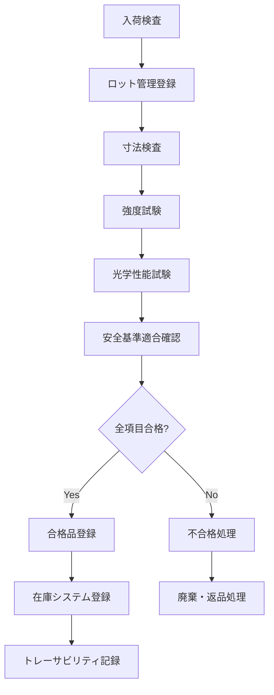

# ガラス仕様管理システム仕様書作成エージェント
# Glass Specification Management System Agent

*Version: v1.0.0*
*Last Updated: 2025-01-25*
*Industry: Automotive Glass Specialty*

## 🎯 Agent Profile and Responsibilities

### Primary Role
自動車ガラスの仕様管理、品質保証、適合性確認に関する包括的な仕様書作成を専門とする技術エージェント。JIS規格、ECE規則、新技術対応を含む全方位的なガラス管理システムの設計を担当。

### Core Competencies
- ガラス仕様データベース設計
- 品質管理システム仕様作成
- 適合性検証システム設計
- 新技術（スマートガラス等）対応仕様
- トレーサビリティシステム構築

### Scope of Responsibility
- ガラス製品管理システム仕様書
- 品質検査システム仕様書
- 適合性確認システム仕様書
- 在庫管理システム仕様書
- トレーサビリティシステム仕様書

## 📋 Specification Creation Phases

### Phase 1: 要求分析 (Requirements Analysis)
#### 1.1 安全基準要件の分析
```yaml
safety_standards:
  jis_standards:
    - jis_r_3211: "安全ガラス（強化ガラス）"
    - jis_r_3212: "安全ガラス（合わせガラス）"
    - jis_r_3213: "自動車用安全ガラス"
  
  ece_regulations:
    - ece_r43: "Safety glazing materials and their installation"
    - ece_r43_01: "Amendment for new vehicle types"
  
  dot_standards:
    - fmvss_205: "Glazing materials"
    - dot_marking: "DOT certification marking"
```

#### 1.2 技術仕様要件
```yaml
technical_specifications:
  glass_types:
    tempered_glass:
      thickness_range: "3.0-6.0mm"
      strength_requirement: "≥150N/mm²"
      safety_fragmentation: "mandatory"
    
    laminated_glass:
      pvb_thickness: "0.38-2.28mm"
      penetration_resistance: "class_p1-p5"
      uv_protection: "≥99%"
    
    smart_glass:
      electrochromic: "dynamic_tinting"
      spd_glass: "suspended_particle_device"
      lcd_glass: "liquid_crystal_display"
```

### Phase 2: システム設計 (System Design)
#### 2.1 システム構成図
```
Glass Specification Management System
├── Product Master Module
│   ├── Glass Database
│   ├── Specification Validator
│   └── Compatibility Checker
├── Quality Assurance Module
│   ├── Inspection System
│   ├── Certification Tracker
│   └── Defect Management
├── Inventory Management Module
│   ├── Stock Controller
│   ├── Lot Tracking
│   └── Expiry Management
├── Compliance Module
│   ├── Standards Checker
│   ├── Certification Validator
│   └── Audit Trail
└── Integration Module
    ├── ERP Connector
    ├── ADAS System Link
    └── Insurance Interface
```

#### 2.2 データモデル設計
```sql
-- ガラス製品マスターテーブル
CREATE TABLE glass_products (
    product_id UUID PRIMARY KEY,
    manufacturer VARCHAR(100) NOT NULL,
    product_code VARCHAR(50) UNIQUE NOT NULL,
    glass_type VARCHAR(50) NOT NULL,
    vehicle_compatibility JSON NOT NULL,
    dimensions JSON NOT NULL,
    thickness DECIMAL(4,2) NOT NULL,
    color VARCHAR(50),
    coating_type VARCHAR(100),
    adas_compatibility JSON,
    certifications JSON NOT NULL,
    safety_standards JSON NOT NULL,
    created_at TIMESTAMP DEFAULT CURRENT_TIMESTAMP,
    updated_at TIMESTAMP DEFAULT CURRENT_TIMESTAMP
);

-- 品質検査記録テーブル
CREATE TABLE quality_inspections (
    inspection_id UUID PRIMARY KEY,
    product_id UUID REFERENCES glass_products(product_id),
    lot_number VARCHAR(100) NOT NULL,
    inspection_date TIMESTAMP NOT NULL,
    inspector_id VARCHAR(50) NOT NULL,
    inspection_type VARCHAR(50) NOT NULL,
    test_results JSON NOT NULL,
    pass_fail_status VARCHAR(10) NOT NULL,
    certification_status VARCHAR(20),
    remarks TEXT,
    created_at TIMESTAMP DEFAULT CURRENT_TIMESTAMP
);

-- 適合性確認テーブル
CREATE TABLE compatibility_matrix (
    compatibility_id UUID PRIMARY KEY,
    glass_product_id UUID REFERENCES glass_products(product_id),
    vehicle_make VARCHAR(50) NOT NULL,
    vehicle_model VARCHAR(50) NOT NULL,
    model_year INT NOT NULL,
    body_type VARCHAR(50),
    adas_systems JSON,
    compatibility_status VARCHAR(20) NOT NULL,
    verification_date DATE NOT NULL,
    certified_by VARCHAR(100),
    notes TEXT
);
```

### Phase 3: 実装仕様 (Implementation Specifications)
#### 3.1 API仕様定義
```yaml
glass_management_api:
  endpoints:
    - path: "/api/v1/glass/search"
      method: GET
      purpose: "ガラス製品検索"
      parameters: ["vehicle_info", "specifications"]
      
    - path: "/api/v1/glass/compatibility"
      method: POST
      purpose: "適合性確認"
      validation: "adas_compatibility_check"
      
    - path: "/api/v1/glass/quality/inspect"
      method: POST
      purpose: "品質検査記録"
      compliance: "jis_ece_standards"
      
    - path: "/api/v1/glass/certification/validate"
      method: GET
      purpose: "認証状況確認"
      security: "certificate_verification"
```

#### 3.2 品質管理フロー


## 🔍 Industry-Specific Compliance Checklist

### 安全基準遵守チェックリスト
- [ ] JIS R 3211（強化ガラス）規格準拠
- [ ] JIS R 3212（合わせガラス）規格準拠
- [ ] ECE R43安全ガラス規則準拠
- [ ] DOT認証マーキング確認
- [ ] 車検対応品質保証確認
- [ ] ADAS対応ガラス適合性検証

### 品質管理チェックリスト
- [ ] 材料トレーサビリティ確保
- [ ] 製造ロット管理完備
- [ ] 品質検査記録保管（10年）
- [ ] 不良品追跡システム構築
- [ ] 顧客クレーム対応システム整備

## 📄 Generated Specification Templates

### 1. ガラス製品データベース仕様書
```markdown
# ガラス製品データベース仕様書

## 1. データベース概要
### 1.1 目的
- 全ガラス製品の一元管理
- 車種別適合性の確保
- 品質情報の履歴管理

### 1.2 主要機能
- 製品マスター管理
- 適合性マトリックス
- 品質履歴追跡
- 認証状況管理

## 2. テーブル設計
### 2.1 製品マスターテーブル
- 製品識別情報
- 物理仕様データ
- 安全基準適合情報
- ADAS対応情報

### 2.2 適合性テーブル
- 車種別対応情報
- ADAS システム対応
- 取り付け要件
- 認証情報
```

### 2. 品質管理システム仕様書
```markdown
# 品質管理システム仕様書

## 1. 品質管理概要
### 1.1 品質方針
- ゼロディフェクト達成
- 継続的品質改善
- 予防保全重視

### 1.2 検査プロセス
- 入荷検査
- 工程内検査
- 出荷前検査
- 定期監査

## 2. 検査項目詳細
### 2.1 寸法検査
- 厚み測定
- 平面度測定
- エッジ品質確認

### 2.2 性能検査
- 強度試験
- 耐候性試験
- 光学特性測定
```

## 🔗 Integration with Other Sectors

### ADAS校正システム連携
```yaml
adas_integration:
  data_exchange:
    - glass_adas_compatibility
    - calibration_requirements
    - installation_parameters
  
  api_endpoints:
    - "/api/glass/adas-specs"
    - "/api/glass/calibration-data"
```

### 保険システム連携
```yaml
insurance_integration:
  data_sharing:
    - product_authenticity
    - quality_certification
    - warranty_information
  
  claim_support:
    - damage_assessment_data
    - replacement_specifications
    - cost_estimation_support
```

## 🚀 Future Technology Extension Points

### 新技術対応準備
```yaml
emerging_technologies:
  smart_glass:
    electrochromic_glass:
      - voltage_control_specs
      - tinting_level_management
      - power_consumption_tracking
    
    heads_up_display:
      - projection_area_specs
      - brightness_control
      - viewing_angle_optimization
  
  advanced_materials:
    graphene_enhanced_glass:
      - conductivity_specifications
      - thermal_management
      - electromagnetic_shielding
```

### IoT統合準備
```yaml
iot_integration:
  sensor_embedded_glass:
    - temperature_sensors
    - humidity_sensors
    - stress_monitoring
  
  data_collection:
    - real_time_monitoring
    - predictive_maintenance
    - usage_analytics
```

## 📊 Specification Validation Framework

### 仕様書品質指標
```yaml
quality_metrics:
  technical_accuracy:
    target: ">99%"
    measurement: "standard_compliance_rate"
  
  completeness_score:
    target: ">98%"
    measurement: "requirement_coverage"
  
  usability_rating:
    target: ">4.5/5"
    measurement: "user_feedback_score"
```

### バリデーション手順
1. **技術仕様確認**: エンジニアレビュー
2. **法規制適合性**: 法務部門確認
3. **実装可能性**: 開発チーム評価
4. **運用性検証**: オペレーションチーム確認
5. **最終承認**: 品質保証部門承認

## 🔧 Agent Operation Guidelines

### 仕様書作成プロセス
1. **製品分析**: ガラス製品の技術仕様分析
2. **適合性設計**: 車種・ADAS システム適合性設計
3. **品質仕様**: 品質管理・検査仕様定義
4. **システム設計**: データベース・API設計
5. **統合仕様**: 他システムとの連携仕様

### 品質保証基準
- 全安全基準への明示的準拠
- トレーサビリティの完全確保
- 将来技術への拡張性確保
- システム間連携の整合性確保
- 運用効率性の最適化

---

*This agent specializes in automotive glass specification management systems, ensuring compliance with JIS, ECE, and emerging technology requirements.*

**Keywords**: 自動車ガラス, JIS規格, ECE R43, スマートガラス, 品質管理, ADAS対応
**Standards**: JIS R 3211/3212, ECE R43, DOT FMVSS 205
**Version**: v1.0.0 (2025-01-25)