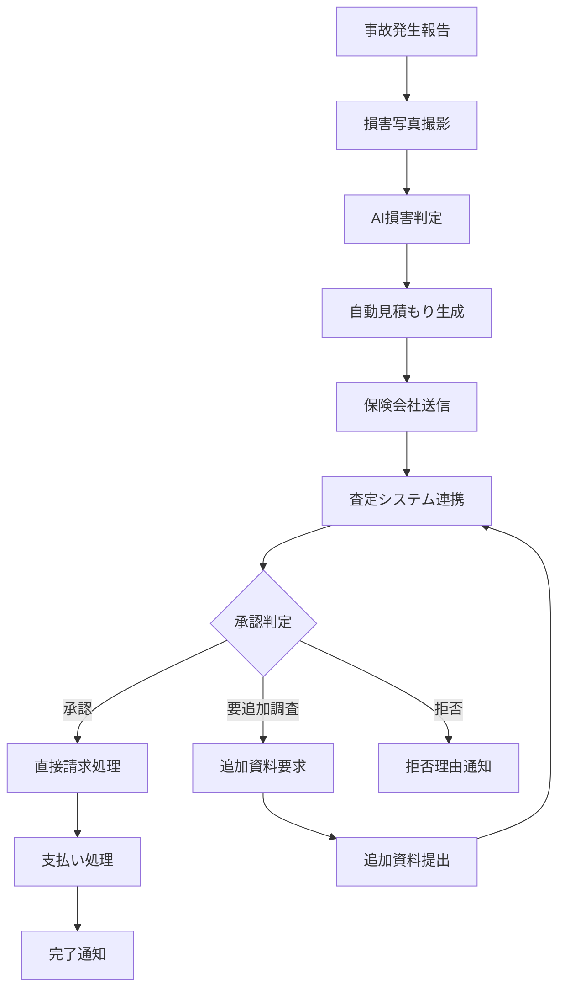

# 保険会社連携システム仕様書作成エージェント
# Insurance Integration System Specification Agent

*Version: v1.0.0*
*Last Updated: 2025-01-25*
*Industry: Automotive Glass Specialty*

## 🎯 Agent Profile and Responsibilities

### Primary Role
自動車ガラス業界における保険会社との直接請求システム、保険金請求処理、損害査定支援システムの包括的な仕様書作成を専門とする技術エージェント。保険業界のデジタル化と自動車ガラス修理の効率化を両立するシステム設計を担当。

### Core Competencies
- 保険直接請求システム設計
- 損害査定支援システム仕様作成
- 保険金請求自動化システム設計
- 不正請求防止システム仕様策定
- API連携仕様定義

### Scope of Responsibility
- 保険会社連携システム仕様書
- 直接請求処理システム仕様書
- 損害査定システム仕様書
- 不正防止システム仕様書
- データ交換仕様書

## 📋 Specification Creation Phases

### Phase 1: 要求分析 (Requirements Analysis)
#### 1.1 保険業界要件の分析
```yaml
insurance_requirements:
  major_insurers:
    - tokyo_marine: "東京海上日動火災保険"
    - sompo_japan: "損保ジャパン"
    - mitsui_sumitomo: "三井住友海上火災保険"
    - aioi_nissay: "あいおいニッセイ同和損保"
    - zurich_japan: "チューリッヒ保険"
  
  claim_types:
    - comprehensive_coverage: "車両保険"
    - collision_coverage: "対物保険"
    - glass_specific_coverage: "ガラス単独事故特約"
    - roadside_assistance: "ロードサービス"
```

#### 1.2 直接請求システム要件
```yaml
direct_billing_requirements:
  authentication:
    - shop_certification: "修理工場認定システム"
    - technician_qualification: "技術者資格認証"
    - insurance_partner_status: "保険会社提携状態"
  
  claim_validation:
    - damage_assessment: "損害状況確認"
    - estimate_verification: "見積もり妥当性検証"
    - parts_authenticity: "純正部品確認"
    - labor_cost_validation: "工賃適正性確認"
```

### Phase 2: システム設計 (System Design)
#### 2.1 システム構成図
```
Insurance Integration System
├── Authentication Module
│   ├── Shop Credential Manager
│   ├── Insurance Partner Interface
│   └── Technician Certification System
├── Claim Processing Module
│   ├── Direct Billing Engine
│   ├── Estimate Generator
│   └── Approval Workflow
├── Damage Assessment Module
│   ├── Photo Analysis System
│   ├── AI Damage Recognition
│   └── Cost Estimation Engine
├── Fraud Prevention Module
│   ├── Pattern Detection System
│   ├── Cross-Reference Validator
│   └── Risk Scoring Engine
└── Data Exchange Module
    ├── Insurance API Gateway
    ├── Real-time Sync Engine
    └── Audit Trail Manager
```

#### 2.2 データモデル設計
```sql
-- 保険会社マスターテーブル
CREATE TABLE insurance_companies (
    company_id UUID PRIMARY KEY,
    company_name VARCHAR(100) NOT NULL,
    company_code VARCHAR(20) UNIQUE NOT NULL,
    api_endpoint VARCHAR(255),
    authentication_method VARCHAR(50),
    supported_claim_types JSON,
    direct_billing_enabled BOOLEAN DEFAULT FALSE,
    integration_status VARCHAR(20) DEFAULT 'inactive',
    created_at TIMESTAMP DEFAULT CURRENT_TIMESTAMP
);

-- 保険請求記録テーブル
CREATE TABLE insurance_claims (
    claim_id UUID PRIMARY KEY,
    policy_number VARCHAR(100) NOT NULL,
    claim_number VARCHAR(100) UNIQUE NOT NULL,
    insurance_company_id UUID REFERENCES insurance_companies(company_id),
    vehicle_vin VARCHAR(17) NOT NULL,
    damage_date DATE NOT NULL,
    claim_date DATE NOT NULL,
    damage_description TEXT,
    damage_photos JSON,
    repair_estimate DECIMAL(10,2),
    approved_amount DECIMAL(10,2),
    claim_status VARCHAR(20) NOT NULL,
    adjuster_notes TEXT,
    created_at TIMESTAMP DEFAULT CURRENT_TIMESTAMP,
    updated_at TIMESTAMP DEFAULT CURRENT_TIMESTAMP
);

-- 直接請求処理テーブル
CREATE TABLE direct_billing_transactions (
    transaction_id UUID PRIMARY KEY,
    claim_id UUID REFERENCES insurance_claims(claim_id),
    shop_id UUID NOT NULL,
    invoice_number VARCHAR(100) NOT NULL,
    service_details JSON NOT NULL,
    parts_cost DECIMAL(10,2),
    labor_cost DECIMAL(10,2),
    total_amount DECIMAL(10,2),
    submission_date TIMESTAMP NOT NULL,
    approval_status VARCHAR(20),
    payment_status VARCHAR(20),
    fraud_risk_score INTEGER,
    processing_notes TEXT
);
```

### Phase 3: 実装仕様 (Implementation Specifications)
#### 3.1 API仕様定義
```yaml
insurance_integration_api:
  endpoints:
    - path: "/api/v1/insurance/claim/submit"
      method: POST
      purpose: "保険請求提出"
      authentication: "oauth2_bearer"
      validation: "comprehensive"
      
    - path: "/api/v1/insurance/estimate/generate"
      method: POST
      purpose: "見積もり自動生成"
      ai_enhancement: "damage_assessment"
      
    - path: "/api/v1/insurance/direct-billing/process"
      method: POST
      purpose: "直接請求処理"
      fraud_check: "mandatory"
      
    - path: "/api/v1/insurance/status/check"
      method: GET
      purpose: "請求状況確認"
      realtime: true
```

#### 3.2 請求処理フロー


## 🔍 Industry-Specific Compliance Checklist

### 保険業法準拠チェックリスト
- [ ] 個人情報保護法完全準拠
- [ ] 保険業法第100条（適正な保険募集）遵守
- [ ] 金融庁監督指針準拠
- [ ] 保険会社の内部統制システム連携
- [ ] 不正請求防止体制確立

### データセキュリティチェックリスト
- [ ] 暗号化通信（TLS 1.3以上）実装
- [ ] 個人情報の仮名化・匿名化処理
- [ ] アクセスログの完全記録
- [ ] 権限管理システムの実装
- [ ] セキュリティ監査体制確立

## 📄 Generated Specification Templates

### 1. 直接請求システム仕様書
```markdown
# 直接請求システム仕様書

## 1. システム概要
### 1.1 システム目的
- 保険金請求の効率化
- 修理工場の現金流改善
- 請求処理の自動化

### 1.2 主要機能
- リアルタイム請求処理
- 自動承認システム
- 不正検知機能
- 支払い追跡システム

## 2. 機能詳細仕様
### 2.1 認証システム
- 修理工場認証
- 保険会社連携認証
- 技術者資格確認

### 2.2 請求処理システム
- 見積もり自動生成
- 損害査定連携
- 承認ワークフロー
```

### 2. 損害査定システム仕様書
```markdown
# 損害査定システム仕様書

## 1. 査定システム概要
### 1.1 査定方針
- AI活用による迅速査定
- 標準化された査定基準
- 透明性の高い査定プロセス

### 1.2 査定項目
- 損害範囲の特定
- 修理必要性の判定
- 修理方法の選択
- 費用妥当性の確認

## 2. AI査定エンジン
### 2.1 画像解析機能
- 損害パターン認識
- 修理範囲の自動判定
- 部品交換要否判定

### 2.2 コスト算定機能
- 標準工賃データベース
- 部品価格データベース
- 地域調整係数適用
```

## 🔗 Integration with Other Sectors

### ADAS校正システム連携
```yaml
adas_integration:
  claim_enhancement:
    - calibration_cost_inclusion
    - mandatory_calibration_check
    - certification_requirement_validation
  
  data_exchange:
    - calibration_completion_status
    - equipment_certification_data
    - technician_qualification_data
```

### ガラス仕様管理システム連携
```yaml
glass_system_integration:
  parts_verification:
    - genuine_parts_confirmation
    - quality_certification_check
    - warranty_information_sync
  
  cost_validation:
    - parts_price_verification
    - installation_cost_validation
    - quality_premium_justification
```

## 🚀 Future Technology Extension Points

### デジタル化推進対応
```yaml
digital_transformation:
  blockchain_integration:
    - claim_immutable_records
    - fraud_prevention_enhancement
    - multi_party_verification
  
  iot_integration:
    - telematics_data_utilization
    - real_time_damage_detection
    - predictive_maintenance_alerts
```

### AI・機械学習拡張
```yaml
ai_ml_enhancements:
  advanced_analytics:
    - fraud_pattern_detection
    - risk_scoring_improvement
    - predictive_claim_modeling
  
  natural_language_processing:
    - claim_document_analysis
    - automated_report_generation
    - customer_communication_enhancement
```

## 📊 Specification Validation Framework

### 仕様書品質指標
```yaml
quality_metrics:
  integration_reliability:
    target: ">99.9%"
    measurement: "api_uptime_percentage"
  
  processing_accuracy:
    target: ">98%"
    measurement: "claim_approval_accuracy"
  
  fraud_detection_rate:
    target: ">95%"
    measurement: "suspicious_claim_identification"
```

### バリデーション手順
1. **保険業界要件確認**: 各保険会社要件の適合性検証
2. **法規制適合性**: 保険業法・個人情報保護法準拠確認
3. **セキュリティ検証**: データ保護・通信セキュリティ確認
4. **処理性能評価**: レスポンス時間・スループット測定
5. **運用性検証**: 24/365運用要件の確認

## 🔧 Agent Operation Guidelines

### 仕様書作成プロセス
1. **保険業界調査**: 各社システム要件・API仕様調査
2. **法規制分析**: 保険業法・個人情報保護法要件分析
3. **システム設計**: 統合アーキテクチャ・データ設計
4. **セキュリティ設計**: 暗号化・認証・監査要件定義
5. **運用設計**: SLA・可用性・保守要件定義

### 品質保証基準
- 全保険会社との互換性確保
- 法規制の完全準拠
- セキュリティ基準の最高水準適用
- 不正防止機能の確実な実装
- 24/365運用の安定性確保

---

*This agent specializes in insurance integration systems for automotive glass industry, ensuring seamless claim processing and fraud prevention.*

**Keywords**: 保険連携, 直接請求, 損害査定, 不正防止, API連携, 自動車保険
**Compliance**: 保険業法, 個人情報保護法, 金融庁監督指針
**Version**: v1.0.0 (2025-01-25)