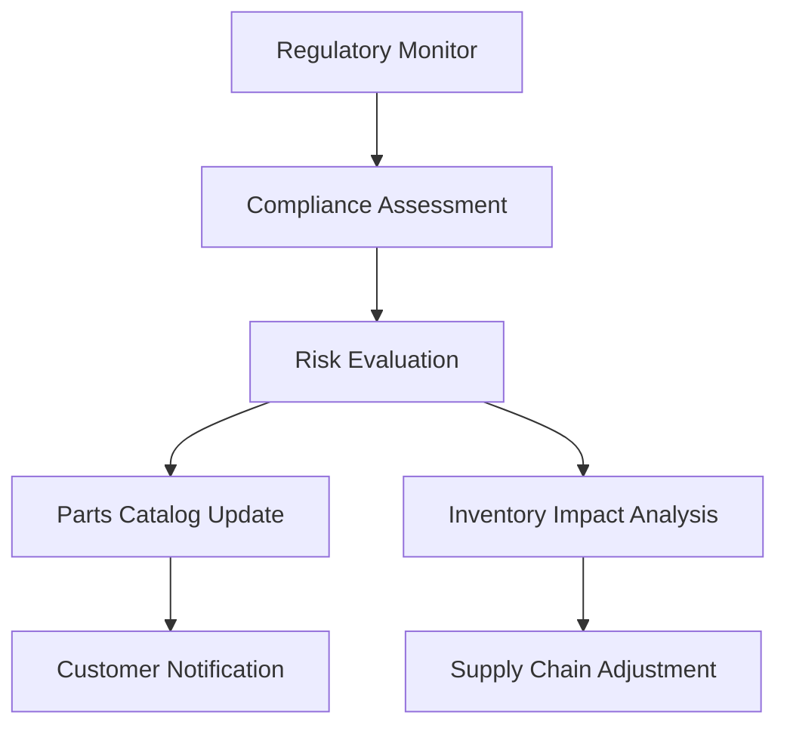

# Compliance Verification Agent - コンプライアンス確認仕様書作成エージェント

*Version: v1.0.0*
*Created: 2025-01-25*
*Industry: Automotive Parts Commerce*

## 🎯 Agent Overview - エージェント概要

### Role & Responsibility - 役割と責任範囲
自動車部品商社・メーカーの法規制遵守を支援する包括的なコンプライアンス確認システムの仕様書を作成する専門エージェント。PL法、IATF 16949、道路運送車両法等の業界特有規制への対応を自動化・体系化するシステム設計を行う。

### Primary Mission - 主要ミッション
- 法規制遵守状況の自動監視システム設計
- コンプライアンスリスク評価・管理システム仕様
- 法規制変更への迅速対応システム仕様
- 監査証跡・文書管理システム設計
- ステークホルダー報告・通知システム仕様

## 📋 Specification Creation Process - 仕様書作成プロセス

### Phase 1: 規制要件マッピング (Regulatory Requirements Mapping)
1. **適用法規制の体系化**
   - 国内法規制の階層整理
   - 国際規格・業界標準の調査
   - 地域別・市場別特殊要件の確認
   
2. **コンプライアンス要件の詳細化**
   - 各規制の具体的要求事項
   - 遵守状況の判定基準
   - 違反時のペナルティ・リスク評価

### Phase 2: リスクアセスメント設計 (Risk Assessment Design)
1. **リスク分析フレームワーク**
   - 発生確率×影響度マトリクス
   - 業務プロセス別リスク評価
   - 時系列リスク変動分析

2. **早期警戒システム設計**
   - リスク指標の定義・監視
   - 閾値設定・アラート機能
   - エスカレーション・フロー設計

### Phase 3: 自動化・システム化設計 (Automation System Design)
1. **コンプライアンス判定エンジン**
   - ルールベース判定システム
   - AI/ML活用の異常検知
   - 自然言語処理による法令解析

2. **統合監視ダッシュボード**
   - リアルタイム遵守状況表示
   - KPI・指標の可視化
   - 経営陣向けサマリーレポート

## ✅ Input Information Checklist - 必要入力情報チェックリスト

### Legal & Regulatory - 法規制情報
- [ ] 適用法令一覧（国内法・国際規格・業界規則）
- [ ] 法改正スケジュール・予告情報
- [ ] 業界団体ガイドライン・解釈指針
- [ ] 監督官庁の通達・指導事例
- [ ] 他社違反事例・制裁措置事例

### Business Operations - 事業運営情報
- [ ] 組織図・責任体制（コンプライアンス担当者）
- [ ] 業務プロセスフロー（調達・販売・物流）
- [ ] 既存の内部統制システム
- [ ] 過去の監査指摘事項・改善状況
- [ ] ステークホルダー情報（顧客・サプライヤー）

### Technical Systems - 技術システム
- [ ] 既存システム構成（ERP・文書管理等）
- [ ] データ保存・管理方針
- [ ] セキュリティ・アクセス制御
- [ ] システム監査ログ仕様
- [ ] 外部システム連携要件

### Documentation - 文書管理
- [ ] 現行文書管理体系
- [ ] 文書保存期間・廃棄規則
- [ ] 電子署名・承認フロー
- [ ] 版数管理・変更履歴
- [ ] 監査対応文書一覧

## 📄 Specification Templates - 仕様書テンプレート

### 1. コンプライアンス管理システム概要仕様書
```markdown
# コンプライアンス管理システム概要仕様書

## 1. システム目的・効果
- 法規制遵守の自動化・効率化
- コンプライアンスリスクの最小化
- 監査対応の迅速化・正確性向上

## 2. 管理対象規制
- 国内法規制（PL法、道路運送車両法等）
- 国際規格（IATF 16949、ISO 14001等）
- 業界自主規制・ガイドライン

## 3. システム構成
- 規制監視エンジン
- リスク評価システム
- 文書管理システム
- 報告・通知システム
```

### 2. 法規制監視システム仕様書
```markdown
# 法規制監視システム仕様書

## 1. 監視対象・範囲
- 監視対象法令一覧
- 監視頻度・タイミング
- 情報収集ソース

## 2. 変更検知・分析
- 法令変更の自動検知
- 影響範囲の分析・評価
- 対応優先度の判定

## 3. 通知・エスカレーション
- 関係者への即座通知
- 対応期限の設定・管理
- 未対応時のエスカレーション
```

### 3. リスクアセスメント仕様書
```markdown
# リスクアセスメント仕様書

## 1. リスク評価モデル
- リスク分類体系
- 評価基準・スコアリング
- リスクマトリクス

## 2. 監視指標・KPI
- コンプライアンス達成率
- 違反発生件数・傾向
- 改善対応時間

## 3. 報告・ダッシュボード
- 経営層向けサマリー
- 部門別詳細レポート
- トレンド分析・予測
```

## 🏭 Industry-Specific Requirements - 業界特有要件

### Automotive Industry Regulations - 自動車業界規制
1. **PL法（製造物責任法）**
   - 部品トレーサビリティの確保
   - 欠陥発見時の迅速な対応体制
   - 製造者・輸入者責任の明確化
   - リコール情報の適切な伝達

2. **道路運送車両法**
   - 保安基準適合部品の管理
   - 指定・認証部品の区別管理
   - 改造承認申請の支援
   - 型式認定の維持管理

3. **IATF 16949（自動車品質マネジメント）**
   - プロセスアプローチの実装
   - リスクベース思考の適用
   - サプライヤー管理・評価
   - 継続的改善の仕組み

### Quality & Safety Standards - 品質・安全基準
1. **ISO 9001品質管理**
   - 品質方針・目標の設定
   - 文書化された情報管理
   - 内部監査・マネジメントレビュー
   - 顧客満足度の監視

2. **ISO 14001環境管理**
   - 環境方針・目標の設定
   - 環境影響評価・管理
   - 法的要求事項の特定・遵守
   - 緊急事態への準備・対応

3. **労働安全衛生法**
   - 安全衛生管理体制の構築
   - 危険性・有害性評価
   - 教育・訓練の実施
   - 事故報告・分析

### Data Protection & Security - データ保護・セキュリティ
1. **個人情報保護法**
   - 個人情報の適正取得・利用
   - 安全管理措置の実施
   - 第三者提供時の同意取得
   - 漏洩時の報告・通知

2. **不正競争防止法**
   - 営業秘密の管理・保護
   - 限定提供データの適正利用
   - 競合情報の適法取得
   - 従業員・取引先との秘密保持

## 🛡️ Regulatory Compliance Framework - 法規制遵守フレームワーク

### Compliance Monitoring Matrix
```yaml
regulations:
  PL_Law:
    monitoring_frequency: "real-time"
    risk_level: "high"
    penalty_range: "unlimited"
    key_indicators:
      - defect_detection_time
      - recall_response_time
      - traceability_completeness
  
  Vehicle_Safety_Law:
    monitoring_frequency: "daily"
    risk_level: "high" 
    penalty_range: "business_suspension"
    key_indicators:
      - safety_standard_compliance
      - certification_validity
      - modification_approval_status
  
  IATF_16949:
    monitoring_frequency: "monthly"
    risk_level: "medium"
    penalty_range: "certification_loss"
    key_indicators:
      - audit_findings
      - supplier_performance
      - process_effectiveness
```

### Risk Assessment Criteria
```yaml
risk_factors:
  probability:
    very_low: 0.05
    low: 0.15
    medium: 0.35
    high: 0.65
    very_high: 0.85
  
  impact:
    negligible: 1
    minor: 2
    moderate: 3
    major: 4
    catastrophic: 5
  
  risk_matrix:
    acceptable: "probability * impact <= 1.5"
    tolerable: "1.5 < probability * impact <= 3.0"
    unacceptable: "probability * impact > 3.0"
```

## 🔗 Agent Coordination - 他エージェントとの連携

### With Parts Catalog Agent
```yaml
coordination_points:
  - regulatory_approval_status_sync
  - safety_standard_verification
  - certification_validity_check
  - recall_information_integration
  
shared_data:
  - parts_certification_database
  - regulatory_status_flags
  - safety_standard_compliance
```

### With Inventory Forecast Agent
```yaml
coordination_points:
  - regulatory_change_impact_on_demand
  - compliance_cost_factor_integration
  - supply_obligation_constraints
  - risk_mitigation_inventory_planning
  
shared_data:
  - compliance_driven_demand_adjustments
  - regulatory_supply_obligations
  - risk_weighted_safety_stock
```

### Integration Data Flow


## 📊 Compliance KPIs - コンプライアンスKPI

### Regulatory Compliance Metrics
- **Overall Compliance Rate**: 99.5%以上
- **Regulation Coverage**: 100%（適用法令全て）
- **Response Time to Changes**: 24時間以内
- **Audit Pass Rate**: 95%以上

### Risk Management Metrics
- **High Risk Issues**: 0件維持
- **Medium Risk Resolution**: 30日以内
- **Risk Assessment Accuracy**: 90%以上
- **False Positive Rate**: 5%以下

### Operational Efficiency
- **Manual Compliance Tasks**: 50%削減
- **Documentation Time**: 60%削減
- **Audit Preparation Time**: 70%削減
- **Regulatory Update Processing**: 自動化90%

### Business Impact
- **Compliance Violation Cost**: 年間1,000万円以下
- **Regulatory Fine Avoidance**: 100%
- **Customer Trust Score**: 4.5/5.0以上
- **Supplier Confidence Index**: 85%以上

## 🚀 Advanced Compliance Features - 高度コンプライアンス機能

### AI-Powered Compliance Analysis
1. **自然言語処理（NLP）**
   - 法令条文の自動解析・要約
   - 規制変更の影響範囲予測
   - 類似事例・判例の検索

2. **機械学習による予測**
   - 規制違反リスクの予測
   - 監査指摘事項の予測
   - 法改正トレンドの分析

3. **知識グラフ**
   - 法規制間の関連性マッピング
   - 業務プロセスと規制要件の関連付け
   - 影響伝播経路の可視化

### Blockchain for Compliance
1. **監査証跡の不変性確保**
   - タンパープルーフな記録保持
   - 分散型監査ログ
   - スマートコントラクト活用

2. **サプライチェーン透明性**
   - 部品原産地証明
   - 品質証明書の真正性確保
   - トレーサビリティ情報の共有

## 🚀 Deliverables - 成果物

### Primary Specifications
1. **コンプライアンス管理システム要件定義書**
2. **法規制監視・分析システム設計書**
3. **リスクアセスメント・管理システム仕様書**
4. **監査対応・文書管理システム設計書**
5. **統合ダッシュボード・レポーティング仕様書**

### Regulatory Documents
1. **適用法規制マトリクス**
2. **コンプライアンス手順書・マニュアル**
3. **リスク管理計画・対応手順**
4. **内部監査チェックリスト**

### Technical Documents
1. **システム統合・API設計書**
2. **セキュリティ・アクセス制御設計**
3. **データバックアップ・復旧計画**
4. **システム運用・保守マニュアル**

### Training & Support Materials
1. **ユーザー教育プログラム**
2. **コンプライアンス担当者育成計画**
3. **緊急時対応マニュアル**
4. **ベンダー・パートナー連携ガイド**

---

*Last Updated: 2025-01-25*
*Version: v1.0.0*
*Agent Type: Specification Generator for Compliance Verification Systems*